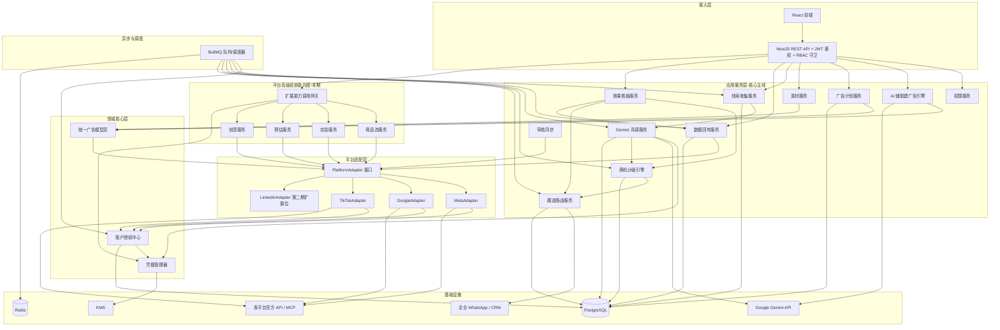
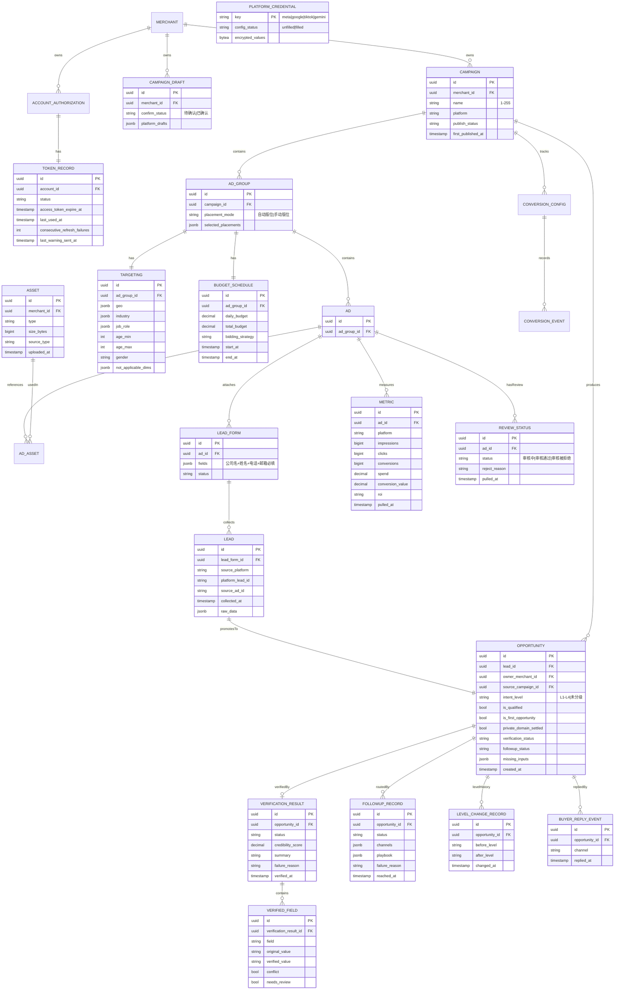

# 设计文档：平台代运营式多平台投流获客系统

## Overview

> 概述

本系统是一套「AI 驱动型外贸精准获客投流平台」（平台代运营式多平台投流获客系统），对标竞品 WÀ商机。核心价值：外贸商家只需提供**已制作完成的成品广告素材（广告视频/图片等）+ 一句产品定位描述 + 预算**，系统即全程 AI 自动跑（自动推画像 → 自动建计划 → 自动优化投放 → 高门槛留资 → 自动背调分级），最终产出**精准高意向客户档案**（商机清单 + 单客户详情 + 可导出 Excel/CSV）。系统对成品素材只做**平台合规校验与多平台挂载/引用，不做创意设计制作**；AI 职责限定在投放侧（推画像、建计划、优化投放、Gemini 背调、L1-L4 分级）。默认全自动档，提供「人工审核模式」可按全局或单商家切换为专家把关档（投放前投手确认/微调）。系统遵循竞品验证过的「五步获客法」，并在 Meta + Google 之上**差异化接入 TikTok**。

### 三角色分工（复杂度集中在投手侧）

- **外贸商家客户（Merchant）**：提供成品广告素材 + 接收并跟进回流商机，不自助操盘广告、不负责创意设计。
- **平台投手（Operator）**：资深运营人员，在 AI 自动建广告与投放之后按需介入做进一步优化与人工校准，并管理回流商机；非每次投放的必经环节。
- **系统管理员（Administrator）**：管理平台凭据、账户池与角色权限。

### 五步获客法（系统主流程，前三步 AI 自动）

```
①商家提供成品广告素材（系统只做合规校验与挂载）
   ↓
②系统 AI 自动按买家画像（国家/地区+行业+职位）创建广告计划草案
   ↓ （默认自动确认并投放；可选「人工审核模式」下需投手确认）
③系统 AI 以「商机成效最大化」自动优化并投放到 Meta / Google / TikTok
   ↓
④买家填高门槛留资表单（公司名+姓名+电话+邮箱）→ 线索回流升格为商机
   ↓
⑤Gemini 背调 → 商机分级 L1-L4 → 高意向进企业 WhatsApp/CRM 跟进（商家跟进——关键人工节点）
   ↓
后台：效果看板 + 5 个业务结果指标 + 客户行业调查报告
```

**本系统前三步（建计划、AI 优化、投放）由 AI 自动完成**：AI 负责自动生成计划、自动优化投放、背调、分级，均在投放侧，不含创意设计制作。默认人工审核模式关闭，AI 生成的广告计划草案自动确认并投放；可选开启人工审核模式则投放前需投手确认。资深投手仅在投放后的后续优化阶段按需介入；回流商机的开发跟进由商家负责。

### 三条设计主线

1. **统一广告对象模型 + 平台适配器**：用「广告系列→广告组→广告」三级统一模型屏蔽 Meta/Google/TikTok 差异，每平台一个 `PlatformAdapter` 实现，新增平台不动既有映射（LinkedIn 仅留扩展位）。
2. **账户授权中心**：集中管理三平台代客户授权与令牌生命周期（保活、过期预警、刷新失败停止、撤销检测）。
3. **商机获客闭环**：成品素材（合规校验+挂载）→ AI 自动建广告（默认自动确认投放）→ 投放 → 高门槛留资回流 → Gemini 背调 → 分级 → WhatsApp 跟进 → 效果看板与业务指标。

### 端到端：输入 → 全流程 → 输出（回溯总图）

```
【输入】商家：成品广告素材 + 一句产品定位 + 预算；管理员：平台凭据（一次性）
   ↓
①AI 推画像（Gemini 据定位推国家/地区+行业+职位，需求9.1）
②AI 建广告（三级结构+挂素材+预算+高门槛表单+排除/相似定向，需求8/9/10/12）
③档位判断（默认全自动直投；专家把关档需投手确认，需求9.3/9.4）
④AI 投放到 Meta/Google/TikTok（需求13）
⑤AI 投放后优化（每15分钟读数据→调投放，目标=有效高意向商机数，需求9.9-9.16）
⑥买家填高门槛留资表单（公司名+姓名+电话+邮箱，需求14）
⑦质量闸门（格式/反作弊/企业身份初判，不合格不计入，需求14.9-14.12）→15分钟内升格商机
⑧Gemini 背调补全（官网/地区/行业/职位/社媒+可信度，需求15）
⑨AI 分级 L1-L4（需求16）
⑩高意向自动进 WhatsApp/CRM 跟进（需求17）
   ↓
【输出】精准高意向客户档案 ×4 形态：
   - 看板商机清单（按等级/平台/状态筛选，L4 优先，需求21.13）
   - 单客户详情页（完整档案+背调+跟进剧本，需求21.15）
   - 一键导出 Excel/CSV（需求21.14）
   - 商机数据对外 API（供后续 CRM 拉取/增量同步，需求35）
   附带：效果看板五项业务指标 + 客户行业调查报告（需求21）
```

### 技术栈

| 层 | 技术选型 |
|---|---|
| 后端框架 | Node.js + TypeScript + NestJS |
| 主数据库 | PostgreSQL |
| 缓存/队列 | Redis + BullMQ（令牌保活、指标拉取、审核轮询、线索回流、背调与重试、分级重算、自动路由） |
| 前端 | React |
| 凭据加密 | KMS 信封加密，无 KMS 降级为本地 AES-256-GCM |
| AI 辅助 / 背调 | Google Gemini API（建广告草案、投放优化、客户背调），凭据缺失时对应 AI 能力降级为不可用 |
| 跟进通道 | 企业 WhatsApp Business API + CRM 直连通道 |

### 密钥后置与优雅降级（贯穿设计）

所有凭据配置化、可后填。缺凭据时对应平台/能力标记为「不可用」，其余正常运行（需求 1.4/1.5、需求 6）。

### 设计范围与需求映射

本设计覆盖全部 34 条需求（获客主线 1-21 + 高级投放能力全集 22-34，均本期实现）。

| 模块 | 主要承载需求 |
|---|---|
| 凭据管理器 Credential Manager | 1、6 |
| 账户授权中心 Auth Center | 2、3、4、5 |
| 多角色权限 RBAC Service | 7 |
| 统一广告模型层 Unified Model Layer | 8、10 |
| AI 辅助建广告引擎 AICampaignAssistant | 9 |
| 平台适配器 Platform Adapters | 8、10、11、13、19、20 |
| 素材服务 Asset Service | 11 |
| 广告计划服务 Campaign Service | 8、12、13 |
| 线索收集服务 Lead Service | 14 |
| Gemini 背调服务 Verification Service | 15 |
| 商机分级引擎 Opportunity Scoring Engine | 16 |
| 跟进路由服务 FollowUp Routing Service | 17、21（买家回复事件） |
| 数据回传服务 Metrics Service | 18、19 |
| 审核同步 Review Sync | 20 |
| 效果看板服务 Dashboard Service | 21 |
| 平台高级投放能力层（本期） | 22-34 |

## Architecture

> 总体架构

分层 + 模块化。领域核心层只认识统一模型，平台差异封装在适配层。平台高级投放能力层与获客主线同属本期实现。



### 分层职责

- **接入层**：React + NestJS REST API，所有请求先经 JWT 认证与 RBAC 守卫（需求 7）。
- **应用服务层（核心主线）**：AI 辅助建广告、广告计划、素材、线索、背调、分级、跟进、数据回传、审核同步、效果看板、权限。
- **平台高级投放能力层（本期）**：扩展能力调用网关 + 商品流/实验/预估/创意服务，与获客主线同期实现，充分利用三平台高级 API。
- **领域核心层**：统一广告模型层、账户授权中心、凭据管理器，平台无关。
- **平台适配层**：`PlatformAdapter` 接口 + Meta/Google/TikTok 实现 + LinkedIn 扩展位。
- **异步与调度（BullMQ）**：令牌保活刷新、令牌状态扫描、指标 15 分钟拉取、审核轮询、线索回流后触发背调、背调失败重试、分级重算、商机自动路由、跟进失败重试。

### 异步任务与调度设计

| 任务 | 触发 | 周期/策略 | 关联需求 |
|---|---|---|---|
| Meta 授权有效性检测 | 定时 | 每 15 分钟 | 2.4、2.5 |
| Google 令牌保活刷新 | 定时 | 距上次使用 80-90 天触发 | 3.3、3.4 |
| 令牌状态扫描（预警/过期/失败计数） | 定时 | 每 15 分钟 | 5.2、5.3、5.5 |
| 指标拉取 | 定时 | 每 15 分钟 | 18.5、18.6 |
| 审核状态轮询 | 定时 | 每 15 分钟 | 20.1、20.2 |
| 线索回流（轮询模式） | 定时 | 平台不支持 webhook 时轮询 | 14.5 |
| 线索回流后触发 Gemini 背调 | 队列 | 凭据已填入才入队，否则跳过并标背调不可用 | 15.2、15.3 |
| Gemini 背调失败重试 | 队列重试 | 失败保留原始数据、置「背调失败」、指数退避 | 15.4 |
| 商机意向等级重算 | 背调/行为数据变更触发 | 重算覆盖并记变更轨迹 | 16.1、16.5 |
| 商机自动路由 | 等级达阈值触发 | 通道已配置则自动路由置「已触达」 | 17.3 |
| 跟进路由失败重试 | 队列重试 | 失败置「路由失败」保留商机待重试 | 17.7 |

## Components and Interfaces

> 核心组件与接口（以下为获客主线组件 1-15；高级投放能力组件见文末简述）

### 1. 凭据管理器（Credential Manager）（需求 1、6）

职责：平台与 Gemini 凭据的配置化存储、加密、脱敏、内存清理。

```typescript
type PlatformId = 'meta' | 'google' | 'tiktok' | 'linkedin';
type CredentialKey = PlatformId | 'gemini';
type CredentialConfigStatus = 'unfilled' | 'filled';

interface CredentialManager {
  submitCredential(key: CredentialKey, values: Record<string, string>):
    Promise<{ status: CredentialConfigStatus } | { errors: { key: string; reason: string }[] }>;
  getConfigStatus(key: CredentialKey): Promise<CredentialConfigStatus>;
  useDecrypted<T>(key: CredentialKey, name: string, fn: (plain: string) => Promise<T>): Promise<T>;
  redact(text: string): string; // 暴露不超过末 4 位
}
```
要点：当且仅当全部必填项提交且通过校验为 `filled`（需求 1.1）；空值/非法拒绝且状态不变（需求 1.7）；KMS 信封加密、无 KMS 降级 AES-256-GCM、失败不落明文（需求 1.8、6.1）；`useDecrypted` 用后清零内存明文（需求 6.3、6.4）；`redact` + 日志/响应拦截器输出前脱敏（需求 6.2、6.5）；未填入平台标不可用返回「该平台凭据未配置」（需求 1.4、1.5）。

### 2. 账户授权中心（Auth Center）（需求 2-5）

```typescript
type TokenStatus = '有效' | '即将过期' | '已过期' | '需重新授权' | '授权已撤销';
interface AuthCenter {
  authorizeMeta(merchantId: string, p: MetaAuthParams): Promise<AccountAuthorization>;
  authorizeGoogle(merchantId: string, p: GoogleAuthParams): Promise<AccountAuthorization>;
  authorizeTikTok(merchantId: string, p: TikTokAuthParams): Promise<AccountAuthorization>;
  refreshToken(tokenId: string): Promise<TokenRecord>;
  evaluateTokenStatus(token: TokenRecord, now: Date): TokenStatus; // 纯函数，状态机核心
  detectRevocation(accountId: string): Promise<AuthStatus>;
  getAuthorizationSummary(): Promise<Array<{ platform: PlatformId; accountId: string; status: TokenStatus; remainingDays: number }>>;
}
```
要点：`evaluateTokenStatus` 输出唯一状态（需求 5.1），0-7 天→即将过期、到期未刷新→已过期（需求 5.2、5.3）；刷新成功更新有效期、置有效、复位失败计数（需求 5.4）；连续失败 3 次置需重新授权并停止刷新（需求 5.5）；Google 80-90 天保活、达 90 天置需重新授权（需求 3.3、3.4）；三平台授权差异收敛在 `authModelMeta`，失败保持未授权（需求 2.7、4.5）。

### 3. 统一广告模型层（Unified Model Layer）（需求 8、10、含版位字段）

```typescript
interface UnifiedModelLayer {
  mapToNative(platform: PlatformId, unified: UnifiedAdObject):
    FieldMappingResult | { errors: MappingValidationError[] };
  mapFromNative(platform: PlatformId, native: Record<string, unknown>): UnifiedAdObject;
}
```
三级结构每个子级有且仅有一个父级（需求 8.1）；统一↔原生字段映射，缺原生字段有默认值则应用默认、无默认则标不适用（需求 8.5）；映射校验失败返回字段名+原因分类不提交（需求 8.7）；广告组层级含版位字段（自动/手动二选一，需求 33）；LinkedIn 维度扩展位（需求 8.9、10.5）。

### 4. 平台适配器（Platform Adapter）（需求 8、10、11、13、19、20）

```typescript
interface PlatformAdapter {
  readonly platform: PlatformId;
  publishCampaign(ctx: AdapterContext, plan: UnifiedAdPlan): Promise<PublishResult>;
  applyTargeting(ctx: AdapterContext, adGroupId: string, t: Targeting): Promise<TargetingResult>;
  uploadAsset(ctx: AdapterContext, asset: AssetRef): Promise<AssetUploadResult>;
  attachLeadForm(ctx: AdapterContext, adId: string, form: LeadFormConfig): Promise<LeadFormResult>;
  submitConversionTracking(ctx: AdapterContext, cfg: ConversionConfig): Promise<ConversionResult>;
  fetchMetrics(ctx: AdapterContext, q: MetricsQuery): Promise<NativeMetrics>;
  fetchReviewStatus(ctx: AdapterContext, adIds: string[]): Promise<NativeReviewStatus[]>;
  supportedBiddingStrategies(): BiddingStrategy[];
}
```
Meta/Google/TikTok 实现完整；LinkedInAdapter 方法体抛 `NotImplementedException` 作第二期扩展位。`AdapterContext.callWithCredential` 经凭据管理器取令牌、用后清理。

### 5. AI 辅助建广告引擎（AICampaignAssistant）（需求 9）

> 本引擎将旧设计的「产品知识库 + AI 行业报告 + 买家画像 + 广告草案 + AI 优化」**合并为一个能力**：投手提供**成品广告素材**与买家画像维度（国家/地区+行业+职位）→ 生成多平台广告计划草案（草案中素材为对成品素材的挂载/引用，引擎不做创意设计）→ 投手确认后才投放 → 对已投放计划给优化建议或受限自动优化。

```typescript
type DraftConfirmStatus = '待确认' | '已确认';
interface CampaignDraft {
  id: string; merchantId: string;
  confirmStatus: DraftConfirmStatus;        // 新草案恒为「待确认」
  platformDrafts: PlatformDraft[];          // Meta/Google/TikTok 草案：系列/组/广告/定向/预算/素材/表单建议
}
interface OptimizationSuggestion { adjustmentItem: string; before: unknown; after: unknown; expectedDelta: number; }

interface AICampaignAssistant {
  // 产品定位描述 → AI 自动推导买家画像（来源标记 AI 自动推导/人工指定，需求 9.1）
  derivePersona(actor: Actor, input: { positioning: string; materials: AssetRef[] }):
    Promise<{ persona: BuyerPersona; source: 'AI自动推导' } | { unavailable: true } | { error: string[] }>;
  // 凭据已填入才生成；缺素材/画像维度返回全部缺失项不生成（需求 9.2、9.7、9.8）
  generateDraft(actor: Actor, input: { materials: AssetRef[]; persona: BuyerPersona }):
    Promise<CampaignDraft | { unavailable: true } | { error: string[] }>;
  // 自动化档位：全自动档自动确认投放；专家把关档置待确认（需求 9.3、9.5）
  resolveReviewMode(merchantId: string): Promise<'全自动' | '专家把关'>; // 全局默认 + 单商家覆盖（需求 9.4）
  // 草案确认状态机纯函数：仅「已确认」可投放（需求 9.5、9.6）
  canPublish(draft: CampaignDraft): boolean;
  // 确认后驱动广告计划服务进入创建+投放（需求 9.3）
  confirm(actor: Actor, draftId: string): Promise<{ confirmStatus: '已确认'; campaignIds: string[] }>;
  // 已投放计划优化：MCP 优先否则官方 API（需求 9.9、9.10）；数据缺失不生成（需求 9.12）
  analyze(actor: Actor, campaignId: string): Promise<OptimizationSuggestion[] | { dataUnavailable: true }>;
  // 受限自动优化：仅在上下限内应用，超限转人工，失败保留原配置（需求 9.11、9.13、9.14）
  applyAuto(actor: Actor, campaignId: string, bounds: AutoBounds): Promise<AutoApplyResult>;
}
```
Gemini 凭据未填入时整个能力降级为不可用、不中断其余功能（需求 9.5）。

**极致投流引擎——以有效高意向商机为唯一优化目标（需求 9.15、9.16）**：投放与出价优化目标对齐「有效高意向商机数」（背调可信度达标或意向等级达阈值的商机），而非曝光/点击量；预算优先分配给历史回流高意向商机占比更高的受众与版位组合；积累足量回流后基于高意向商机特征生成相似扩展受众建议与低意向人群排除建议（配合需求 10.8、10.9 的排除定向与相似受众），持续提升回流客户质量与购买意向。

#### 5.1 「商机成效最大化」优化 → 官方 API 映射（重要回溯记录）

> 各平台**没有**单一的「优化 API」。优化 = 我方 AI 编排（读数据 → 决策 → 改配置/托管）+ 三类官方能力组合。本系统的优化分**投放前（建计划时一次性）**与**投放后（每 15 分钟持续）**两段，对应官方 API 如下。

**投放前优化（建计划时，对应需求 9.2）——把计划搭到最优起点：**

| 平台 | 官方 API / 能力 | 用途 |
|---|---|---|
| Meta | 官方 MCP 连接器（2026.4，唯一）+ Marketing API | AI 助手直连广告户做计划优化；建系列/组/广告、配定向预算出价 |
| Meta | Advantage+ 系列（需求 23） | Meta AI 全自动受众/版位优化投放 |
| Meta | Reach/Delivery Estimate API（需求 29） | 投放前预估触达/询盘量，择优再投 |
| Google | Performance Max（需求 25）+ 智能出价全集（需求 26） | Google AI 跨全版位自动投放；出价策略推荐（建议预算+预测性能） |
| Google | Reach Forecasting（ReachPlanService，需求 29） | 投放前触达预估（令牌需单独 allowlist） |
| TikTok | Smart+ 全自动系列 / Marketing API | TikTok AI 自动投放；建计划 |

**投放后优化（广告已在跑，每 15 分钟，对应需求 9.9-9.16）——拿真实回流数据持续调优：**

| 平台 | 读（取效果） | 改 / 托管（调投放） |
|---|---|---|
| Meta | Insights API | Marketing API 改预算/出价/定向；或交 Advantage+ 智能托管 |
| Google | 报表 API（最详尽） | Google Ads API 改配置；智能出价持续自学习 |
| TikTok | Reporting API | Marketing API 改配置；Smart+ 智能托管 |

**优化编排策略（对应需求 9.10）**：①**读**——各平台 Insights/Reporting API 拉曝光/点击/转化/花费/回流商机等级；②**想**——Meta 优先走官方 MCP 连接器，其余平台用 Gemini + 官方 API 数据推理；③**改/托管**——经 Marketing/Ads API 改配置，或将部分优化托管给平台智能投放（Advantage+ / PMax / Smart+）与智能出价。

**「有效高意向」回传闭环（关键，避免开发跑偏）**：平台智能出价**只能优化到「转化/线索」层级**（平台只知有人填表，不知该线索经 Gemini 背调后是否 L4）。因此「以有效高意向商机为目标」（需求 9.15）是**我方系统自有的优化逻辑**，两条手段叠加实现：
- **对内**：把「哪些人群/版位回流了高意向商机」反喂给投放后优化（加/减预算、相似扩展、低意向排除）。
- **对外**：通过**离线/CRM 转化回传 API**（Meta Conversions API 离线转化、Google 离线转化上传，需求 32）把「这条线索实际为 L3/L4」回传给平台，使平台智能出价也朝高质量人群学习。

### 6. 广告计划服务（Campaign Service）（需求 8、12、13）

三级 CRUD（父级不存在拒绝、必填缺失返回全部缺失字段、数量上限 5000）；预算 0.01-999999999.99、日预算≤总预算、排期结束不早于开始、出价须被平台支持（需求 12）；投放状态机 `未提交→提交中→已提交/投放失败/投放超时`、30 秒超时、重复提交拦截、非有效授权阻止投放（需求 13）；投放成功且 `first_published_at` 为空时写入首次投放时间（供需求 21 投放时长）。

### 7. 素材服务（Asset Service）（需求 11）

上传**成品广告素材**（广告视频/图片/PDF/轮播等，单文件≤500MB、轮播 2-10、记录来源类型与上传时间）并做**平台合规校验**（格式/尺寸/时长/文件大小）；投手挂载素材到广告时由适配器上传/引用至平台，**不做创意改写或重新设计**；**单份失败隔离不中断整批**（需求 11.3）；不完整素材不保留；被引用素材拒绝删除（需求 11.7）。

### 8. 线索收集服务（Lead Service）（需求 14）

高门槛留资表单（公司名+姓名+电话+邮箱必填，1-30 字段）；缺任一必填项拒绝回流（需求 14.4）；通过校验后 15 分钟内回流升格为商机；按来源平台+线索标识去重保留最早（需求 14.7）；失败保留原始数据待重试。**留资质量校验（需求 14.9-14.12）**：对每条留资做邮箱/电话格式校验、一次性邮箱域名与无效占位值识别、机器人/批量提交反作弊过滤、企业身份初判；低质量/疑似作弊留资标记区分存储、不计入有效线索，确保回流商机质量与购买意向极高。

### 9. Gemini 背调服务（Verification Service）（需求 15）

```typescript
type VerifiableField = 'companyName' | 'phone' | 'email' | 'industry' | 'jobTitle';
interface VerifiedField { field: VerifiableField; originalValue?: string; verifiedValue?: string; conflict: boolean; needsReview: boolean; }
interface VerificationService {
  isAvailable(): Promise<boolean>; // 复用 getConfigStatus('gemini')
  verify(opportunityId: string, lead: RawLead): Promise<VerificationResult>;
  mergeFields(original: Partial<Record<VerifiableField,string>>, verified: Partial<Record<VerifiableField,string>>): VerifiedField[]; // 纯函数
}
```
凭据缺失降级仍存储商机（需求 15.3）；调用失败保留原始数据置「背调失败」待重试（需求 15.4）；冲突字段同时保留两值标「待核实」（需求 15.5）。

### 10. 商机分级引擎（Opportunity Scoring Engine）（需求 16）

```typescript
type IntentLevel = 'L1' | 'L2' | 'L3' | 'L4' | '未分级';
interface OpportunityScoringEngine {
  score(input: { verification?: VerificationResult; personaMatch?: number; behavior?: BehaviorData }):
    { level: IntentLevel; missingInputs: string[] }; // 纯函数，输出唯一等级
  levelRank(level: IntentLevel): number;             // L4=4>L3=3>L2=2>L1=1>未分级=0
  recompute(opportunityId: string, input: ScoringInput): Promise<LevelChangeRecord>;
  listByLevel(actor: Actor, filter?: { levels?: IntentLevel[] }): Promise<Opportunity[]>;
}
```
缺必需输入置「未分级」记缺失项（需求 16.3）；变更重算覆盖并记变更轨迹（需求 16.5、16.6）。

### 11. 跟进路由服务（FollowUp Routing Service）（需求 17、21.6）

```typescript
type FollowUpStatus = '待路由' | '已触达' | '跟进中' | '路由失败';
interface FollowUpRoutingService {
  autoRoute(opp: Opportunity, threshold: IntentLevel): Promise<FollowUpRecord | { kind: 'channel_unconfigured' }>;
  manualRoute(actor: Actor, oppId: string, channels: ('whatsapp'|'crm')[]): Promise<FollowUpRecord | { kind: 'channel_unconfigured' }>;
  generatePlaybook(opp: Opportunity, inputs: PlaybookInputs): FollowupPlaybook;
  nextStatus(current: FollowUpStatus, e: { channelsConfigured: boolean; routeSucceeded?: boolean }): FollowUpStatus; // 纯函数状态机
  recordBuyerReply(oppId: string, channel: 'whatsapp'|'crm', repliedAt: Date): Promise<BuyerReplyEvent>;
}
```
跟进状态唯一（需求 17.1）；达阈值且 WhatsApp 配置自动路由置已触达（需求 17.3）；通道未配置保持「待路由」不丢商机（需求 17.6）；失败置「路由失败」保留待重试（需求 17.7）；成功路由后生成销售跟进剧本（需求 17.5）；`recordBuyerReply` 供有效联络率判定（需求 21.6）。

### 12. 数据回传服务（Metrics Service）（需求 18、19）

每 15 分钟拉取各平台曝光/点击/转化/花费并归一化；`computeRoi(value, spend)` 花费为零返「不可计算」（需求 18.3）；单平台失败保留上次成功数据继续其余（需求 18.7）；转化事件关联/未匹配（需求 19.5、19.6）。

### 13. 审核状态同步（Review Sync）（需求 20）

每 15 分钟拉取审核状态归一化为「审核中/审核通过/审核被拒绝」三态；变更通知；拉取失败保留上次状态。

### 14. 效果看板服务（Dashboard Service）（需求 21）

```typescript
type MetricValue<T> = { kind:'value'; value:T } | { kind:'incomputable'; note:'不可计算' } | { kind:'unavailable'; note:'数据不可用' };
interface DashboardService {
  load(actor: Actor, range: TimeRange, platform?: PlatformId): Promise<Dashboard | { error: '时间范围无效' }>;
  validateRange(range: TimeRange, now: Date): boolean; // 纯函数，结束早于开始无效，跨度1-365天默认7
  costPerQualifiedLead(i: { spend: number|null; qualifiedLeadCount: number|null }): MetricValue<number>;       // 询盘成本
  effectiveContactRate(i: { contactedCount: number|null; totalCount: number|null }): MetricValue<number>;     // 联络率
  intentLevelDistribution(i: { levelCounts: Record<'L1'|'L2'|'L3'|'L4',number>|null }): MetricValue<IntentDistribution>; // 占比+L3+L4高意向
  timeToFirstOpportunity(i: { firstPublishedAt: Date|null; firstOpportunityAt: Date|null; hasOpportunity: boolean }):
    { kind:'duration'; seconds:number } | { kind:'noOpportunity'; note:'暂无商机' } | { kind:'unavailable' };  // 投放时长
  leadAssetOwnership(actor: Actor, opp: { merchantId: string; privateDomainSettled: boolean }): { accessible: boolean; settled: boolean }; // 客户资产
  exportIndustrySurvey(actor: Actor, range: TimeRange): Promise<IndustrySurveyReport | { error: '时间范围无效' }>; // 客户行业调查报告导出
  // —— 核心交付物：精准客户信息 —— //
  listOpportunities(actor: Actor, filter: OpportunityFilter): Promise<OpportunityListItem[]>;   // 商机清单（按等级/平台/跟进状态/时间筛选，L4优先排序，需求21.13）
  getOpportunityDetail(actor: Actor, opportunityId: string): Promise<OpportunityDetail | { error: '权限不足' }>; // 单客户完整档案（需求21.15）
  exportOpportunities(actor: Actor, filter: OpportunityFilter, format: 'excel'|'csv'): Promise<ExportFile>;     // 导出 Excel/CSV，空集生成仅表头（需求21.14、21.16）
}
```
**核心交付物（需求 21.13-21.17）**：商机清单/详情/导出三者构成系统面向商家的精准客户信息交付。清单行含留资四件套 + 意向等级 + 可信度 + 跟进状态；详情聚合原始留资 + 质量校验标注 + 背调补全字段 + 等级变更轨迹 + 跟进剧本（拼装 `LEAD`+`OPPORTUNITY`+`VERIFICATION_RESULT`+`VERIFIED_FIELD`+`LEVEL_CHANGE_RECORD`+`FOLLOWUP_RECORD`）；导出按当前筛选生成 Excel/CSV，空集返回仅含表头的文件；三者一律经 RBAC 数据隔离，越权返回「权限不足」无数据泄露（需求 21.17、需求 7）。
5 个业务指标均为确定性纯函数：有效线索数/商机总数/已分级数为零时返「不可计算」（需求 21.7，与 18.3 零除一致）；尚无商机返「暂无商机」（需求 21.8）；客户资产归属 Merchant、停投不丢失、越权拒绝（需求 21.9、21.10）；行业调查报告维度缺失或 Gemini 凭据缺失标「数据不可用」不中断（需求 21.12）。

### 15. 权限服务（RBAC Service）（需求 7）

```typescript
type Role = 'merchant' | 'operator' | 'administrator';
interface RbacService {
  authorize(actor: Actor, action: Action, resource: ResourceRef): AuthorizationDecision; // 纯函数
  audit(actor: Actor, resource: ResourceRef, at: Date): Promise<void>;
}
```
管理员管凭据/账户池/权限；投手仅分配商家；商家仅自身；越权拒绝无副作用记审计；未认证返回「未认证」。

### 高级投放能力组件（需求 22-34，本期实现，简述）

扩展能力调用网关（统一受理扩展能力调用、按支持平台集校验、凭据缺失降级，需求 22）；其下：Meta Advantage+（23）、商品流服务/动态商品广告（24）、Google PMax（25）、智能出价策略全集（26）、TikTok Spark Ads（27）、A/B 实验服务（28）、投前预估服务（29）、消息广告 CTWA/CTM（30）、AI 创意生成服务（31）、离线/CRM 转化通道（32）、广告版位管理（33，版位字段已在统一模型层预留）、LinkedIn 第二期扩展位（34）。均通过扩展能力网关路由、凭据缺失或平台不支持时降级返回明确错误，不改动统一核心模型。

### 商机数据对外 API（Opportunity Data API）（需求 35）

为后续自有 CRM 系统接入预留的标准化只读/同步接口。独立于「CRM 跟进通道（推送触达）」，本 API 面向外部系统**主动拉取/增量同步**商机档案。

```typescript
interface OpportunityDataApi {
  // API 凭证鉴权 + 商家数据隔离；无效/吊销凭证返回未认证（需求 35.2、35.3、35.8）
  authenticate(apiCredential: string): Promise<{ merchantId: string } | { error: '未认证' }>;
  // 分页 + 按 updatedSince 增量；仅返回凭证绑定商家数据（需求 35.1、35.5、35.6）
  queryOpportunities(ctx: { merchantId: string }, q: { updatedSince?: Date; cursor?: string; pageSize?: number }):
    Promise<{ items: OpportunityRecord[]; nextCursor?: string }>;
  // 单条读取，跨商家访问按 RBAC 拒绝（需求 35.4）
  getOpportunity(ctx: { merchantId: string }, opportunityId: string): Promise<OpportunityRecord | { error: '权限不足' }>;
}
interface ApiCredentialService { // 签发/吊销 + 加密存储脱敏（需求 35.7）
  issue(merchantId: string): Promise<{ apiKey: string }>;
  revoke(apiKeyId: string): Promise<void>;
}
```
要点：`OpportunityRecord` 含留资字段 + 背调补全 + 可信度 + 意向等级 + 跟进状态 + 来源 + 采集/更新时间（需求 35.1）；API 凭证经凭据管理器加密存储与脱敏（需求 35.7）；按凭证限流，超限返回「请求过于频繁」不中断（需求 35.9）；响应带版本标识保证契约稳定（需求 35.10）；全程受 JWT/API 凭证鉴权与 RBAC 数据隔离（需求 35.2-35.4、需求 7）。该 API 不写广告/投放数据，仅暴露商机档案读取与增量同步。

## Data Models

> 数据模型（核心实体）



关键说明：
- **三级父级唯一**：AD_GROUP→CAMPAIGN、AD→AD_GROUP 外键非空（需求 8.1）。
- **草案确认状态机**：CAMPAIGN_DRAFT.confirm_status 新草案恒「待确认」，确认后驱动 CAMPAIGN 创建投放（需求 9.2、9.3）。
- **商机源自线索**：OPPORTUNITY.lead_id 与 LEAD 一对一；owner_merchant_id 资产归属、停投不删除（需求 21.9）；private_domain_settled 私域沉淀标记（需求 17）；source_campaign_id + is_first_opportunity 供投放时长计算（需求 21）。
- **意向等级唯一**：intent_level 取值 L1-L4/未分级且任一时刻唯一（需求 16.2）。
- **背调冲突**：VERIFIED_FIELD 冲突时同时保留两值并 needs_review（需求 15.5）。
- **敏感字段**：PLATFORM_CREDENTIAL.encrypted_values、TOKEN_RECORD 令牌均加密，不落明文（需求 6.1）。
- **高级投放能力实体**（简述）：PRODUCT_FEED/PRODUCT_SET、ASSET_GROUP、EXPERIMENT、OFFLINE_CONVERSION、EXTENSION_CAPABILITY 等，于对应能力实现时新增，不改获客主线核心实体。

## Correctness Properties

> 正确性属性（覆盖核心主线纯逻辑；外部平台/AI 调用由集成测试以 mock 覆盖）

### Property 1: 凭据配置状态等价不变量
*对任意* 平台与已提交凭据集合，状态为 filled 当且仅当全部必填项均提交且通过校验。
**Validates: Requirements 1.1, 1.2**

### Property 2: 非法凭据被拒且状态不变
*对任意* 空值或不符合要求的提交，拒绝保存、返回不符合项、状态不变。
**Validates: Requirements 1.7**

### Property 3: 凭据脱敏不可逆出明文
*对任意* 凭据明文与嵌入它的文本，脱敏后不含完整明文且暴露不超过末 4 位。
**Validates: Requirements 6.2, 6.5**

### Property 4: 凭据存储加密往返
*对任意* 合法凭据，持久化值≠明文且授权解密可还原。
**Validates: Requirements 6.1**

### Property 5: 平台功能可用性隔离
*对任意* 各平台填入状态组合，标记不可用集合恰为未填入集合，其余正常。
**Validates: Requirements 1.4**

### Property 6: 令牌状态机唯一性不变量
*对任意* 令牌记录与时间，状态机输出唯一且属于五态集合，区间映射与剩余有效期一致。
**Validates: Requirements 5.1, 5.3, 3.4**

### Property 7: 即将过期映射与预警幂等
*对任意* 剩余 0-7 天令牌，状态为「即将过期」且同一预警仅发一次。
**Validates: Requirements 5.2**

### Property 8: 刷新成功复位不变量
*对任意* 刷新前状态，刷新成功后有效期更新、置有效、失败计数复位 0。
**Validates: Requirements 5.4, 4.3**

### Property 9: 连续刷新失败阈值停止
*对任意* 失败序列，连续失败达 3 次置需重新授权并停止刷新。
**Validates: Requirements 5.5**

### Property 10: Google 保活触发区间
*对任意* 上次使用时间，距今 80（含）-90（不含）天触发保活刷新。
**Validates: Requirements 3.3**

### Property 11: 三级结构父级唯一不变量
*对任意* 广告对象树，每个广告组唯一父级系列、每个广告唯一父级广告组。
**Validates: Requirements 8.1**

### Property 12: 统一↔原生字段映射往返一致
*对任意* 合法统一广告对象，可映射字段范围内往返映射得等价对象。
**Validates: Requirements 8.4**

### Property 13: 默认值与不适用标记规则
*对任意* 统一字段与平台，无原生字段有默认值则应用默认、否则标不适用且提示含维度名。
**Validates: Requirements 8.5, 10.4**

### Property 14: 映射校验失败返回分类错误且不提交
*对任意* 越界/格式/必填缺失输入，返回字段名+原因分类、不提交、保留输入。
**Validates: Requirements 8.7, 10.7**

### Property 15: 广告系列名称长度约束
*对任意* 长度 1-255 名称接受、0 或超 255 拒绝。
**Validates: Requirements 8.2**

### Property 16: 父级不存在拒绝建子级
*对任意* 不存在父级，建子级被拒返回「父级对象不存在」不创建。
**Validates: Requirements 8.6**

### Property 17: 数量上限约束
*对任意* 广告组/广告数量超 5000 拒绝创建。
**Validates: Requirements 8.8**

### Property 18: 草案确认状态机（待确认不得投放）
*对任意* 草案，新草案恒「待确认」，canPublish 当且仅当「已确认」为真；对「待确认」草案的发布请求被拒。
**Validates: Requirements 9.2, 9.4**

### Property 19: 获客方案缺失项完整反馈
*对任意* 从草案生成输入移除的必填子集（素材或画像维度），返回缺失项集合恰为被移除项且不生成草案。
**Validates: Requirements 9.6**

### Property 20: 受众取值域约束
*对任意* 年龄 13-65、性别男/女/不限接受，越界或非法拒绝。
**Validates: Requirements 10.1**

### Property 21: 素材单份失败隔离不变量
*对任意* 含成功/失败份的素材批次，成功集合不受失败份影响，失败份被隔离不中断整批。
**Validates: Requirements 11.3**

### Property 22: 素材约束与不符合项完整反馈
*对任意* 上传素材，≤500MB 且轮播 2-10 接受，否则返回全部不符合项不存储。
**Validates: Requirements 11.1, 11.2**

### Property 23: 被引用素材不可删除
*对任意* 正被引用素材，删除被拒并提示正在引用。
**Validates: Requirements 11.7**

### Property 24: 预算取值域约束
*对任意* 预算值，0.01-999999999.99 接受、超出返回「预算超出允许范围」不保存。
**Validates: Requirements 12.1, 12.5**

### Property 25: 日预算不大于总预算
*对任意* 日预算>总预算返回错误不保存，否则接受。
**Validates: Requirements 12.6**

### Property 26: 排期时间有效性
*对任意* 结束不早于开始保存，否则返回「排期时间无效」不保存。
**Validates: Requirements 12.3, 12.4**

### Property 27: 出价方式受平台支持约束
*对任意* 出价方式不在平台支持集返回「出价方式不受支持」不保存。
**Validates: Requirements 12.7**

### Property 28: 非有效授权阻止投放
*对任意* 授权为需重新授权/已撤销的账户，投放被阻止状态保持未提交。
**Validates: Requirements 13.4**

### Property 29: 提交中拒绝重复投放
*对任意* 处于「提交中」的计划，重复投放被拒。
**Validates: Requirements 13.6**

### Property 30: 留资高门槛必填校验
*对任意* 缺公司名/姓名/电话/邮箱任一的留资，拒绝回流不升格为商机。
**Validates: Requirements 14.4**

### Property 31: 线索去重幂等保留最早
*对任意* 含重复的回流序列，按来源平台+线索标识去重保留最早，重复执行幂等。
**Validates: Requirements 14.7**

### Property 32: ROI 计算与零花费
*对任意* 指标，花费>0 时 ROI=价值/花费，花费=0 标「不可计算」。
**Validates: Requirements 18.2, 18.3**

### Property 33: 单平台失败隔离
*对任意* 失败平台子集，失败平台保留上次成功数据、其余正常更新。
**Validates: Requirements 18.7**

### Property 34: 转化事件关联/未匹配二分
*对任意* 回传转化事件，可匹配则关联正确广告、否则记「未匹配」保留原始数据。
**Validates: Requirements 19.5, 19.6**

### Property 35: 背调凭据缺失降级仍存储商机
*对任意* 回流商机与「Gemini 凭据未填入」，商机仍存储、背调能力标不可用、不发起背调。
**Validates: Requirements 15.3**

### Property 36: 背调失败保留原始数据待重试
*对任意* 背调失败，记录原因、置「背调失败」、保留原始留资与商机待重试。
**Validates: Requirements 15.4**

### Property 37: 背调冲突字段同时保留并标待核实
*对任意* 原始留资与背调返回字段，冲突字段标 conflict+needsReview 且同时保留两值，一致/单侧不标。
**Validates: Requirements 15.5**

### Property 38: 商机意向等级唯一性与取值域
*对任意* 背调+画像匹配度+行为数据输入，输出唯一等级且属于 {L1,L2,L3,L4,未分级}。
**Validates: Requirements 16.1, 16.2**

### Property 39: 分级数据缺失置未分级并记缺失项
*对任意* 移除必填输入子集，输出「未分级」且缺失项集合恰为被移除项。
**Validates: Requirements 16.3**

### Property 40: 按意向等级排序单调性
*对任意* 商机集合，排序后相邻等级权重非递增（L4>L3>L2>L1>未分级）。
**Validates: Requirements 16.4**

### Property 41: 等级重算覆盖并记录变更
*对任意* 新输入，重算等级=score(新输入)并覆盖，变化时生成含旧/新等级与精确到秒时间的变更记录，幂等。
**Validates: Requirements 16.5, 16.6**

### Property 42: 跟进状态机综合不变量
*对任意* 当前状态与事件，输出唯一且属于四态；达阈值且 WhatsApp 配置置「已触达」；通道未配置保持「待路由」不丢商机；失败置「路由失败」保留待重试。
**Validates: Requirements 17.1, 17.3, 17.6, 17.7**

### Property 43: 看板时间范围有效性与缺失隔离
*对任意* 时间范围，结束早于开始返回「时间范围无效」不更新；有效时缺失维度标「数据不可用」其余正常。
**Validates: Requirements 21.2, 21.3, 21.4**

### Property 44: 单条有效询盘成本计算与零除
*对任意* 花费与有效线索数，线索数>0 为商、为零标「不可计算」、缺失标「数据不可用」。
**Validates: Requirements 21.5, 21.7**

### Property 45: 客户有效联络率计算与零除
*对任意* 商机集合，已成功联络=状态∈{已触达,跟进中}且有买家回复；总数>0 为商、为零标「不可计算」。
**Validates: Requirements 21.5, 21.6, 21.7**

### Property 46: 各意向等级占比与高意向占比
*对任意* 各等级计数，已分级数>0 时各占比为商且和为 1、L3+L4 高意向占比=L3占比+L4占比；全未分级标「不可计算」。
**Validates: Requirements 21.5, 21.7**

### Property 47: 投放到首条商机时长与暂无商机
*对任意* 首次投放时间与首条商机时间，有商机时为秒差值、无商机标「暂无商机」、缺失标「数据不可用」。
**Validates: Requirements 21.5, 21.8**

### Property 48: 客户资产停投/重投不丢失
*对任意* 商机集合与停投/重投操作序列，操作后商机集合与归属 owner_merchant_id 不变、不删除。
**Validates: Requirements 21.9**

### Property 49: RBAC 授权决策不变量
*对任意* 角色+分配+资源组合：管理员对凭据/账户池允许、投手仅分配商家、商家仅自身、否则拒绝。
**Validates: Requirements 7.1, 7.2, 7.3**

### Property 50: 越权拒绝无副作用 / 商机资产隔离
*对任意* 越权请求（含访问非自身商机资产），拒绝返回「权限不足」且目标数据不变、不返回资产数据。
**Validates: Requirements 7.4, 21.10**

### Property 51: 广告版位配置二选一
*对任意* 广告组版位设置，配置方式恰为「自动版位」「手动版位」之一；手动为空降级为自动；Advantage+/PMax 强制自动版位。
**Validates: Requirements 33.1, 33.4, 33.7**

## Error Handling

> 错误处理策略：统一异常过滤器归类、脱敏后返回，按级别记日志。

| 错误类别 | 处理策略 | 关联需求 |
|---|---|---|
| 凭据缺失/未配置 | 标平台不可用，返回「该平台凭据未配置」，其余正常 | 1.4、1.5 |
| 凭据校验失败 | 拒绝、返回不符合项、状态不变 | 1.7 |
| 加密/存储失败 | 不落明文、返回原因、状态不变 | 1.8 |
| 授权失效/撤销 | 置需重新授权/授权已撤销、记失败时间、预警 | 2.6、3.7、5.5 |
| 字段映射校验失败 | 返回字段名+原因分类、不提交、保留输入 | 8.7、10.7、19.7 |
| 草案待确认禁止投放 | 拒绝并提示草案尚未确认 | 9.4 |
| AI 能力凭据未配置 | 标 AI 辅助建广告不可用、不中断其余 | 9.5 |
| 投放失败/超时 | 置投放失败/投放超时、记原因/超时提示 | 13.3、13.5 |
| 素材单份失败 | 隔离该份、保留其余、不中断整批 | 11.3 |
| 留资缺必填项 | 拒绝回流不升格商机 | 14.4 |
| 线索回流失败 | 记原因、保留原始数据、入队重试 | 14.8 |
| 指标拉取失败 | 保留上次成功数据、继续其余平台 | 18.7 |
| 背调凭据未配置 | 标背调不可用、正常存商机 | 15.3 |
| 背调调用失败 | 记原因、保留原始数据、置背调失败、重试 | 15.4 |
| 跟进通道未配置 | 返回「跟进通道未配置」、保持待路由、保留商机 | 17.6 |
| 跟进路由失败 | 置路由失败、保留商机待重试、不丢商机 | 17.7 |
| 看板时间范围无效 | 返回「时间范围无效」不更新 | 21.3 |
| 指标零除 | 标「不可计算」 | 21.7 |
| 无商机 | 投放时长标「暂无商机」 | 21.8 |
| 商机资产越权访问 | 拒绝返回「权限不足」、不返回数据 | 21.10 |
| 扩展能力平台不支持/凭据缺失（高级投放） | 返回明确错误、标不可用、其余正常 | 22.3、22.4 |

### 容错与降级原则

- 平台隔离：任一平台失败不影响其他（1.4、18.7、20.5）。
- 重试：线索回流、指标拉取、令牌刷新、背调、跟进路由采用 BullMQ 指数退避；令牌连续失败 3 次停止（5.5）；背调/跟进失败保留数据待重试（15.4、17.7）。
- 优雅降级：缺凭据标不可用而非崩溃；AI/背调凭据缺失降级不中断（9.5、15.3、21.12）。
- 状态保护：校验失败/错误路径保证目标数据不变、不落明文、不提交平台。

## Testing Strategy

> 双轨测试：纯逻辑用属性测试，平台/AI 交互用 mock 集成测试。

| 测试类型 | 范围 | 说明 |
|---|---|---|
| 属性测试（PBT） | 上文 51 条正确性属性所覆盖的纯逻辑 | fast-check，每条最少 100 次迭代 |
| 示例单测 | 授权成功失败、状态记录、CRUD、背调结构、剧本、指标装配等 | |
| 集成测试 | 三平台 API、Gemini 背调、WhatsApp/CRM 路由、调度周期、时间窗口 | mock 外部服务 |
| 冒烟测试 | 无硬编码凭据、LinkedIn 扩展位注册、模块装配 | |

属性测试要求：fast-check，最少 100 次迭代，注释 `// Feature: multi-platform-ad-integration, Property {编号}`；生成器覆盖边界（年龄 13/65、预算 0.01/999999999.99、字段数 1/30、剩余天数 0/7、失败计数 3、意向等级集合、零除、缺失项子集、留资必填缺失、素材成功/失败混合批次）。外部平台 API 与 Gemini/WhatsApp 调用一律 mock。

重点落点：令牌状态机（6-10）、映射往返（12）、草案确认状态机（18）、留资高门槛必填（30）、背调冲突合并（37）、分级唯一性（38-41）、跟进状态机（42）、5 业务指标零除（44-47）、客户资产不丢失（48）、RBAC（49-50）。

## Security

> 安全设计

- **凭据加密**：KMS 信封加密（CMK 包裹 DEK 加密凭据），无 KMS 降级 AES-256-GCM；任何持久化介质不存明文（需求 6.1）。
- **日志/输出脱敏**：日志拦截器 + 响应序列化拦截器输出前调用 redact，暴露不超过末 4 位；敏感值指纹表拦截匹配明文（需求 6.2、6.5）。
- **内存安全**：凭据仅在 useDecrypted 作用域内明文存在、用后清零、不写持久化日志（需求 6.3、6.4）。
- **RBAC 与数据隔离**：JWT 认证 + RbacService.authorize 纯函数决策；投手按 assignedMerchantIds、商家限自身；越权拒绝无副作用记审计；未认证返回「未认证」（需求 7）。商机资产归属 Merchant，访问/导出受 RBAC 约束（需求 21.9、21.10）。
- **AI/通道凭据**：Gemini 与 WhatsApp/CRM 凭据纳入凭据管理器统一加密/脱敏，缺失时降级不可用。

## 需求可追溯性映射表（Requirements Traceability）

| 需求 | 设计组件 | 正确性属性 |
|---|---|---|
| 1 凭据配置化管理 | 凭据管理器 | 属性 1、2、5 |
| 2 Meta 授权 | 账户授权中心 | 属性 6；示例/集成覆盖 2.x |
| 3 Google 授权 | 账户授权中心 | 属性 6、10 |
| 4 TikTok 授权 | 账户授权中心 | 属性 8（刷新） |
| 5 令牌生命周期 | 账户授权中心、令牌状态机 | 属性 6、7、8、9 |
| 6 凭据安全脱敏 | 凭据管理器、安全设计 | 属性 3、4 |
| 7 多角色权限 | 权限服务 | 属性 49、50 |
| 8 统一模型与三级创建 | 统一广告模型层、广告计划服务 | 属性 11、12、13、14、15、16、17 |
| 9 AI 辅助建广告与优化 | AICampaignAssistant | 属性 18、19 |
| 10 受众定向 | 统一模型层、适配器 | 属性 13、14、20 |
| 11 成品素材上传与合规校验 | 素材服务 | 属性 21、22、23 |
| 12 预算出价排期 | 广告计划服务 | 属性 24、25、26、27 |
| 13 广告投放 | 广告计划服务、适配器 | 属性 28、29 |
| 14 高门槛留资回流 | 线索收集服务 | 属性 30、31 |
| 15 Gemini 背调验证 | 背调服务 | 属性 35、36、37 |
| 16 商机分级 L1-L4 | 商机分级引擎 | 属性 38、39、40、41 |
| 17 商机跟进 WhatsApp/剧本 | 跟进路由服务 | 属性 42 |
| 18 数据回传 | 数据回传服务 | 属性 32、33 |
| 19 转化追踪 | 适配器、数据回传服务 | 属性 34 |
| 20 审核状态同步 | 审核同步 | 示例/集成覆盖 20.x |
| 21 效果看板与业务指标 | 效果看板服务 | 属性 43、44、45、46、47、48、50 |
| 22-32 高级投放能力 | 扩展能力网关 + 各扩展服务 | 对应能力实现时补充属性 |
| 33 广告版位管理 | 统一广告模型层（版位字段） | 属性 51 |
| 34 LinkedIn 二期预留 | LinkedInAdapter 扩展位 | 冒烟覆盖 |
